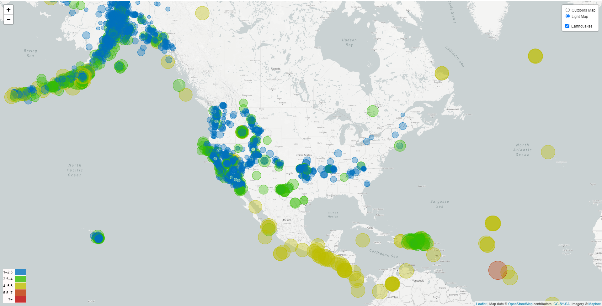
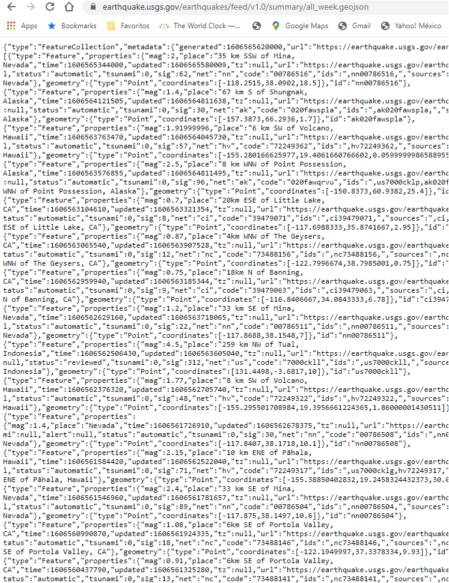
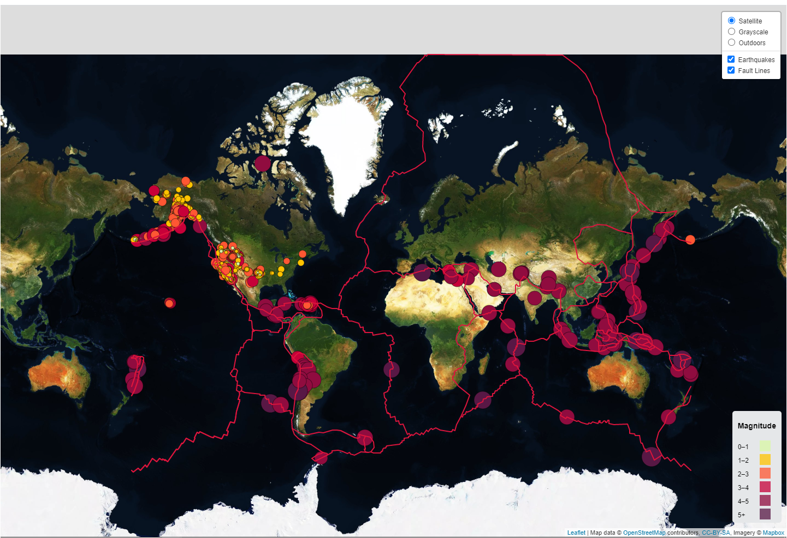
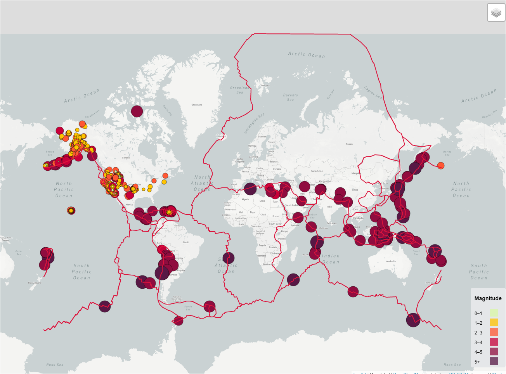
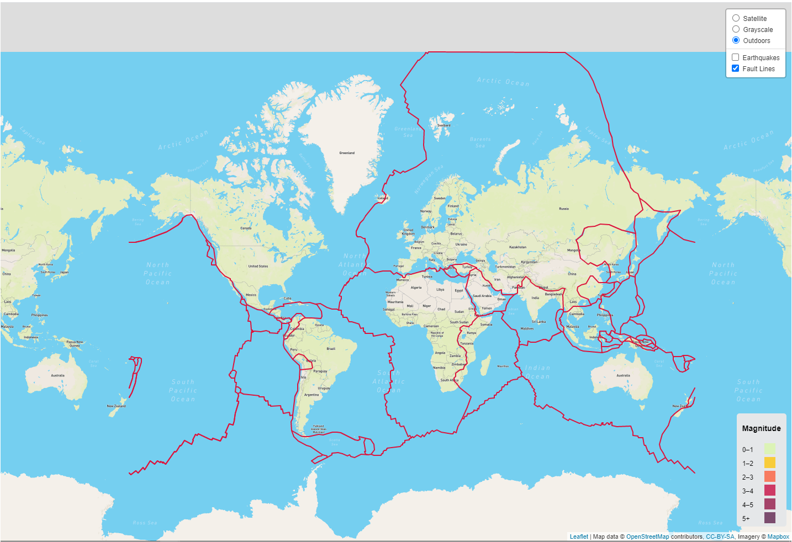

# Leaflet Homework - Geomapping and visualizing Data with Leaflet

## Background

Welcome to the United States Geological Survey, or USGS for short! The USGS is responsible for providing scientific data about natural hazards, the health of our ecosystems and environment; and the impacts of climate and land-use change. Their scientists develop new methods and tools to supply timely, relevant, and useful information about the Earth and its processes. As a new hire, I will be helping them out with an exciting new project!

The USGS is interested in building a new set of tools that will allow them visualize their earthquake data. They collect a massive amount of data from all over the world each day, but they lack a meaningful way of displaying it. Their hope is that being able to visualize their data will allow them to better educate the public and other government organizations (and hopefully secure more funding..) on issues facing our planet.

### My GitHub Repository

1. Create a new repository called `leaflet-challenge`. **Visit my Github io!!**
**[Leaflet-Challenge Github io](https://gabbyolivares.github.io/Leaflet-Challenge/)** 

3. Created a directory for the Leaflet challenge, using  the folder names to correspond to the challenges: **Level 1** and **Level 2**.

4. This homeworks utilizes both **html** and **Javascript** as main files to run for analysis.

## Tools and concepts used
* Leaflet
* GeoJSON
* Map obects
* Tile layers
* Choropleth 
* Config.js
* CSS
* HTML
* Javascript

- - -

### Level 1: Basic Visualization, BASIC MAP!

My first task: visualize an earthquake data set.

CHALLENGE COMPLETE!!

 

 
1. Get the data set from USGS site

   

 

 

   * Visited the [USGS GeoJSON Feed](http://earthquake.usgs.gov/earthquakes/feed/v1.0/geojson.php) page and pick the past 7 Days data set to visualize the last earthquake.
   * Used the URL of this JSON to pull in the data for my visualization.
 

 

   

 

 

- - -

2. **Importing & Visualizing the Data**

   Create a map using Leaflet that plots all of the earthquakes from your data set based on their longitude and latitude.

   * Data markers reflect the magnitude of the earthquake in their size and color. 

   * Earthquakes with higher magnitudes appear larger and darker in color.

   * Included popups that provide additional information about the earthquake when a marker is clicked.

   * Created a legend that will provide context. 

   
- - -

### Level 2: More Data, UPGRADED MAP!

**Satellite  Overlay**

The USGS wants you to plot a second data set on a map to illustrate the relationship between tectonic plates and seismic activity. I need to pull in a second data set and visualize it along side your original set of data. 

Found Data on tectonic plates at <https://github.com/fraxen/tectonicplates>.

Steps:

* Plot a second data set on my map.

* Added a number of base maps to choose from as well as separate out our two different data sets into overlays that can be turned on and off independently.

* Added layer controls to my map for Overlays and choose buttons for Earthquakes and Tectonics plates locations.

**Grayscale Overlay**

**Outdoors Overlay**

CHALLENGE COMPLETE!! 

- - -

### Assessment

Final product will be assessed on the following metrics:

* Completion of assigned tasks

* Visual appearance

* Professionalism

**Gabby Olivares**

### Copyright

Trilogy Education Services © 2019. All Rights Reserved.
